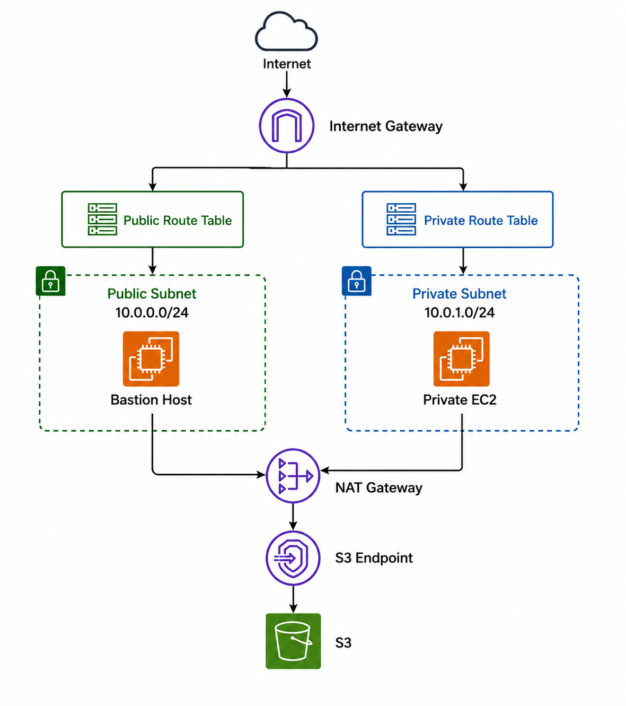

# Enterprise AWS VPC Project

## Objective

Design and deploy a secure enterprise-grade VPC using AWS networking services.

## Technologies

- AWS VPC
- EC2
- Internet Gateway
- NAT Gateway
- Route Tables
- S3 Gateway Endpoint
- IAM

## Architecture

## Features

- Public subnet
- Private subnet
- Internet connectivity
- Outbound-only internet for private resources
- Private S3 access via endpoint
- Bastion host administration

## Testing

### NAT Gateway Validation

Private EC2 successfully downloaded packages through NAT Gateway.

### S3 Endpoint Validation

Private EC2 uploaded objects to S3 without internet access.

## Lessons Learned

- Route table design
- Subnet isolation
- Enterprise network security
- AWS endpoint services

  📑 **Project Overview**
- [Custom VPC](#custom-vpc)
- [Public Subnet](#public-subnet)
- [Private Subnet](#private-subnet)
- [Internet Gateway](#internet-gateway)
- [NAT Gateway](#nat-gateway)
- [Route Tables](#route-tables)
- [Security Groups](#security-groups)
- [EC2-Instance](#ec2-instance)
- [S3 Gateway Endpoint](#s3-gateway-endpoint)

